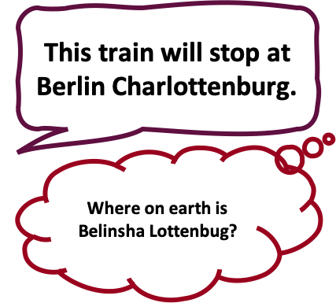
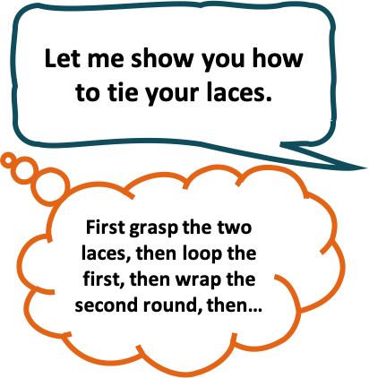

```{r include=FALSE}
library(knitr)
library(kableExtra)
library(tidyverse)
library(gridExtra)
library(grid)

reference <- function(citation, link) {
  paste0("<a href=\"",link,"\" target=\"_blank\">",citation,"</a>")
}
```

<script>
$(document).ready(function(){
    $('[data-toggle="popover"]').popover(); 
});
</script>

Background {data-icon="fa-book-open"}
===================================== 


### Segmenting continuous streams

Speech and action sequences are both __continuous information streams__ that must be successfully __segmented__ into constituent sub-units in order to be understood...

***

<table width="100%" border="0" cellpadding="5">

<tr>

<td align="center" valign="center">

<br />
Unsuccessful speech segmentation.
</td>

<td align="center" valign="center">

<br />
More successful action segmentation. 
</td>

</tr>

</table>
***
In both the speech and action domain, we know this segmentation task is achieved via a __combination of top-down and bottom-up processing__ of the information stream. 


### How top-down and bottom-up processes support segmentation
Work with adults has highlighted top-down and bottom-up cues that support segmentation of speech and action. Some examples are outlined below. 

<div style="overflow-x:auto;">
<table style="table-layout: fixed ;width: 100% ;border-spacing: 10px;border-collapse: separate;" >

<tr>

<td style="width:20%"></td>

<td style="width:40%;" align=center valign=center>

</td>

<td style="width:40%" align=center valign=center>

</td>

</tr>

<tr>

<td align="center" valign="center" style="background-color: #FB8B24;">
<figure>

  <figcaption>Speech</figcaption>
</figure>
</td>
<td style="background-color: #FB8B24;" align="center" valign="center">  
<p style="margin:20px;"> Lexical knowledge supports identifcation of boundaries in speech <a href="https://doi.org/10.1037/0096-1523.33.4.960" target="_blank"> (e.g. Mattys et al., 2007) </a>.</p>
</td>

<td style="background-color: #FB8B24;" align="center" valign="center">  
<p style="margin:20px;"> Prosodic cues (e.g. pasue and pre-boundary lengthening) are produced at phrase boundaries <a href="https://doi.org/10.1080/01690961003589492" target="_blank"> (e.g. Wagner & Watson, 2010) </a>, and listeners make use of these cues to determine the location of phrase boundaries in speech <a href="https://doi.org/10.1023/A:1005192911512" target="_blank"> (e.g. Schafer et al., 2000) </a>. 
</p>
</td>

</tr>

<tr >

<td align="center" valign="center" style="background-color: #9A031E;color: white;">
<figure>

  <figcaption>Action Sequence</figcaption>
</figure>
</td>
<td style="background-color: #9A031E;color: white;" align="center" valign="center">  
<p style="margin:20px;">Observers track the goals and intentions of an actor, and map boundaries to moments of goal-achievement <a href="http://dx.doi.org/10.1037/xlm0000364" style="color:#FF9300;" target="_blank"> (e.g. Levine et al., 2017) </a>.
</p>
</td>


<td style="background-color: #9A031E;color: white;" align="center" valign="center"> 
<p style="margin:20px;">The movement itself contains kinematic cues to boundaries between actions. These kinematic cues include pause and pre-boundary lengthening <a href="https://doi.org/10.3389/fpsyg.2019.01566" style="color:#FF9300;" target="_blank"> (Hilton et al., 2019) </a>, and observers make use of these kinematic cues to determine the location of boundaries in the action sequence <a href="https://doi.org/10.3389/fpsyg.2010.00243" style="color:#FF9300;" target="_blank"> (Hemeren & Thill, 2010) </a>.   
</p>
</td>

</tr>

</table>
</div>


### Developmental Perspective {data-height=150}

- Infants' access to top-down processes is restricted, because they do not yet possess the knowledge/experience.
- __In speech__, it has been proposed that __infants__ therefore initially __capitalise on bottom-up cues__ (prosody) to segment the stream (__Prosodic Bootstrapping Account__; ##ref)
- However, __little is known__ about infants' processing of bottom-up cues during __action segmentation__.
- In a further parallel to early speech processing, __infants may capitalize on kinematic boundary cues__ to initially segment actions, especially when the actions are unfamiliar or not goal-directed.

### Research Questions and Aims {data-height=200}

1. Are infants sensitive to kinematic boundary cues?
    + By examining whether kinematic boundary cues evoke the same ERP component as evoked by prosodic boundary cues during infancy.
2. Do the kinematic boundary cues modulate processing of subsequent actions.
    + Finding that infants are sensitive to kinematic boundary cues would not automatically mean that these cues play a role in action processing.
    + We therefore examined whether the kinematic boundary cues modulate processing of the subsequent action, by examining differences in the ERP response to actions prior to, and following the boundary cues.


   
Procedure {data-icon="fa-video" data-orientation=rows}
=====================================     

Row
-------------------------------------

### Stimuli

- Three child friendly characters were created: 

<table width="100%" border="0" cellpadding="5">

<tr>

<td align="center" valign="center">


</td>

<td align="center" valign="center">


</td>

</td>

<td align="center" valign="center">


</td>


</tr>

</table>

- These characters were then animated to perform sequences of three actions. 

- Two action sequences were defined:

<ol>
  <li> Turn then stretch then jump</li>
  <li> Jump then stretch then turn</li>
</ol>


- On __no-boundary trials__ each sequence was shown as a single continuous sequence. 

- On __boundary trials__, a boundary was signalled between the second and final action. 

- On boundary trials, the boundary was signalled by two kinematic boundary cues:

<ol>
  <li> <b>Pre-boundary lengthening:</b> To achieve pre-boundary lengthening, the second "half" of the pre-boundary action (stretch) was extended by 240 ms, by slowing down the rate at which the character returned to its normal size. </li>
  <li> <b>Pause:</b> Following the completion of the pre-boundary action, the character paused motionless for 350 ms. </li>
</ol>

- These timings were based on typical durations of pre-boundary lengthening and pause as found in naturally-produced speech, and durations of the actions forming the sequences were:

```{r}
NB <- tribble(
  ~actionNB, ~durationNB, 
  "still frame", 1000,
  "action 1", 600, 
  "action 2", 600,
  "pause", 0, 
  "action 3", 750
) 

BC <- tribble(
  ~actionBC, ~durationBC, 
  "still frame", 1000,
  "action 1", 600, 
  "action 2", 840,
  "pause", 350, 
  "action 3", 750
) 

NB <- tribble(
  ~actionNB, ~durationNB, 
  "still frame", 1000,
  "action 1", 600, 
  "action 2", 600,
  "pause", 0, 
  "action 3", 750
) 

BC <- tribble(
 ~durationBC, 
  1000,
  600, 
  840,
  350, 
  750
) 

cbind(NB, BC) %>% 
  mutate(durationNB=case_when(actionNB!="pause"~cell_spec(durationNB, "html", color="#0a0a0a"), 
                            actionNB=="pause"~cell_spec(durationNB, "html", color="#b0b0b0"))) %>% 

  mutate(durationBC=case_when(actionNB!="pause"&actionNB!="action 2"~cell_spec(durationBC, "html", color="#0a0a0a"), 
                            actionNB=="pause"|actionNB=="action 2"~cell_spec(durationBC, "html", color="#962c24", bold=T))) %>% 
  mutate(actionNB=case_when(actionNB!="pause"~cell_spec(actionNB, "html", color="#0a0a0a"), 
                            actionNB=="pause"~cell_spec(actionNB, "html", color="#b0b0b0"))) %>% 
  # mutate(actionBC=case_when(actionBC!="pause"&actionBC!="action 2"~cell_spec(actionBC, "html", color="#0a0a0a"), 
  #                         actionBC=="pause"|actionBC=="action 2"~cell_spec(actionBC, "html", color="#962c24", bold=T))) %>% 
  # 
  
  kable(format = "html", escape = F, col.names = c("Element",
                                                   "Duration (ms)", 
                                                   "Duration (ms)")) %>% 
  kable_styling(full_width = F) %>% 
  add_header_above(c("", "No-boundary Trial" = 1, "Boundary trial" = 1))

```


- Each character performed both sequences with and without a boundary, resulting in a final stimuli set of 12 videos (3 characters x 2 sequences x 2 trial types).

- Here, you can see an example of a no-boundary trial and a boundary trial.
    - _Note_: On web-browsers, these videos do not play at their full time-resolution, meaning that they can appear somewhat jumpy. When presented to participants in the lab, the videos were correctly rendered and smooth. 

Row
-------------------------------------

### No-boundary trial
    
<video src="vids/NBNB1.mp4" type="video/mp4" style="max-width:100%;max-height:100%" controls="controls"></video>

### Boundary trial

<video src="vids/BCPD1.mp4" type="video/mp4" style="max-width:100%;max-height:100%" controls="controls"></video>


Row
-------------------------------------

### Participants 

23 12-month-old infants from German-speaking households contributed data.

```{r}
tribble(
  ~condition,~mean, ~min, ~max,
  "no-boundary", 23.2, 15, 34, 
  "boundary", 25, 14, 37
) %>% 
  mutate(range=paste(min, "-", max)) %>% 
  select(-min, -max) %>% 
  kable(format="html", escape=F, col.names=c("Condition", "Mean no. of trials", "Range"), 
        caption = "Summary statistics of number of artefact-free trials contributed by participants") %>% 
  kable_styling(full_width = F)
```

### EEG testing 

- Infants were shown the 12 stimulus videos in a ranomized order until the infants became bored and thus looked consistently away from the screen. Including breaks and pauses, we typically were able to record EEG from the infants for ~ 10 minutes. 

- EEG was recorded from 30 electrodes. 

- 9 of these electrodes served as critical electrodes for analysis (F3, Fz, F4, C3, Cz, C4, P3, Pz, P4). 

Question 1 {data-icon="fa-question-circle"}
=====================================   

<div style="border:15px solid #5F0F40;border-radius: 25px">
<p style="font-size:24pt; font-weight: bold; margin-top: 1em; margin-bottom: 1em; margin-left: 3em; margin-right: 3em;"> 
 Were infants sensitive to the kinematic boundary cues?
</p>
</div>

- To answer this question, we examined the ERP from the onset of the pre-boundary lengthening (i.e. the mid-point of the second action) until the offset of the final action. 

- To examine whether infants processed the kinematic boundary cues, we examined the ERP in this time interval for evidence of the Closure Positive Shift. 

<div style="border:5px solid black;border-radius: 25px;background-color: white;">
<p style="font-family: times, serif; font-size:16pt; font-weight: bold; margin-top: 1em; margin-bottom: 0em; margin-left: 3em; margin-right: 3em;"> 
  Closure Positive Shift (CPS):  
<hr style="margin-top:0em; margin-bottom:0em; margin-left:2em; width:20%; border-color:black"  />
</p>
<p style="font-family: times, serif; font-size:11pt; margin-top: 0em; margin-bottom: 1em; margin-left: 3em; margin-right: 3em;"> 
An ERP component initially discovered in response to prosodic boundaries in speech <a href="https://doi.org/10.1038/5757" target="_blank">(Steinhauer et al., 1999) </a>. This component is a slow, broadly distributed positivity in the ERP that begins around the onset of the boundary and lasts approximately 500 ms <a href="https://doi.org/10.1162/jocn.2010.21587" target="_blank"> (Boegels et al., 2011) </a>. 
</p>
</div>
***
- Recent work has extended our understanding of the CPS in two critical ways: 

1. The CPS has been found in response to boundaries in speech already during the first year of life `r reference("(Holzgrefe et al., 2018)","https://doi.org/10.1177/0023830917730590")`. 
2. In adults, a CPS-like positivity has been found in response to boundaries in action sequences `r reference("(Hilton et al., 2019)","https://doi.org/10.3389/fpsyg.2019.01566")`.

- We wanted to bring these two strands together, by testing whether a boundary in an action sequence evokes a CPS-like positivity already during infancy


<!-- <script> -->
<!-- $(document).ready(function(){ -->
<!--     $('[data-toggle="popover"]').popover();  -->
<!-- }); -->
<!-- </script> -->
```{r echo=FALSE}
# popover_dt <- data.frame(
#   position = c("adult", "infant"),
#   stringsAsFactors = FALSE
# )
# popover_dt$`Auditory Stimuli` <- cell_spec(
#   c("a", "b", "c", "d"), # Cell texts
#   popover = spec_popover(
#     content = c("aaa", "bbb", "ccc", "eee"),
#     title = NULL,                           # title will add a Title Panel on top
#     position = c("top", "top")
#   ))
# kable(popover_dt, escape = FALSE) %>%
#   kable_styling("striped", full_width = FALSE)
```


Column {data-width=35 }
-------------------------------------
    
### Slow-motion video - ERP for whole sequence

<video height="100%" width="100%" controls>
  <source src="vids/ERP_slow.mp4" type="video/mp4">
</video>


Column {data-width=50 .tabset}
-------------------------------------
   
### ERP - Regions

```{r CPS graph}

pausePlot3<-
  readRDS("data/CPSdata.rds") %>% 
  filter(pauseLength=="short") %>% 
  mutate(location=fct_collapse(electrode, 
                               frontal=c("F3", "Fz", "F4"), 
                               central=c("C3", "Cz", "C4"), 
                               posterior=c("P3", "Pz", "P4")))
colG=c("NB"="#E69F00", "BC"="#56B4E9") 
lineG=c("BC"="solid", "NB" = "solid")

pp4<-pausePlot3 %>% 
  group_by(location, condition, timeCorrect) %>% 
  summarize(meanA=mean(meanAmp)) 

graph.cps.region.data<-
  ggplot()+
  geom_line(data=pp4,aes(x=timeCorrect, y=meanA, color=condition, linetype=condition))+
  scale_y_reverse()+
  facet_wrap(~location, ncol=1)+
  scale_color_manual(values=colG)+
  scale_linetype_manual(values=lineG)+
  jtools::theme_apa(  ) +
  labs(x="time from midpoint of second action (ms)", y = expression(paste("amplitude ( ", mu*V, " )")))+
  theme(legend.position = "none", plot.margin=margin(10,50,10,50))+
  geom_vline(xintercept = 300, color="#E69F00", size=2.5, alpha=.2)+
  geom_vline(xintercept=540, color="#56B4E9", size=2.5, alpha=.2)+
  geom_vline(xintercept=890, color="#56B4E9", size=2.5, alpha=.2)

rect.props<-
  tribble(
    ~action, ~condition, ~xstart, ~xend, 
    "action 2",   "NB",  0, 300,
    "action 3",   "NB",  301, 750+300,
    "action 2",   "BC",  0, 540,
    "pause",      "BC",  541, 890,
    "action 3",   "BC",  891, 1640  
  ) %>% 
  mutate(ystart=ifelse(condition=="NB", 1, 0-.1), 
         yend=ifelse(condition=="NB", 0+.1, -1))

text.props <- 
  tribble(
    ~action, ~condition, ~xpos, 
    "action 2",   "NB",  150, 
    "action 3",   "NB",  300+375,
    "action 2",   "BC",  540/2, 
    "pause",      "BC",  540+(350/2),
    "action 3",   "BC",  540+350+(750/2)
  ) %>% 
  
  mutate(ypos=ifelse(condition=="NB", .5, -.5))

graph.cps.region.stimuli<-
  ggplot()+
  geom_line(data=filter(pausePlot3, electrode=="Fz"),aes(x=timeCorrect, y=meanAmp), color="white")+
  ylim(-1, 1)+
  scale_color_manual(values=colG)+
  scale_linetype_manual(values=lineG)+
  jtools::theme_apa(  ) +
  theme(axis.title.x=element_blank(),
        axis.text.x=element_blank(),
        axis.ticks.x=element_blank(), 
        axis.text=element_text(colour="white"), 
        axis.title.y=element_text(color="white"), 
        axis.ticks.y=element_blank())+
  labs(x="time from midpoint of second action (ms)", y = expression(paste("amplitude ( ", mu*V, " )")))+
  theme(legend.position = "none", plot.margin=margin(10,50,10,50))+
  geom_rect(data=rect.props, aes(xmin=xstart, xmax=xend, ymin=ystart, ymax=yend, color=condition), size=2.5, fill="#ebebeb")+
  geom_text(data=text.props, aes(x=xpos, y=ypos, label=action), size=4)


grid.arrange(graph.cps.region.data, graph.cps.region.stimuli, ncol=1, heights=c(3, 1),
  top = textGrob(
    "Segment start: mid-point of second action.
    Segment end: offset of final action.",
    gp = gpar(fontface = 2, fontsize = 12)
  ), 
  bottom=textGrob(
    "baseline taken during the 200 ms interval prior to onset of first action", 
    gp=gpar(fontsize=9)
  )
)

tosave <- arrangeGrob(graph.cps.region.data, graph.cps.region.stimuli, ncol=1, heights=c(3, 1),
  top = textGrob(
    "Segment start: mid-point of second action.
    Segment end: offset of final action.",
    gp = gpar(fontface = 2, fontsize = 12)
  ), 
  bottom=textGrob(
    "baseline taken during the 200 ms interval prior to onset of first action", 
    gp=gpar(fontsize=9)
  )
)

#ggsave(tosave,file="graphs/CPS.eps", width=34.49, height=33.22, units="cm")
#ggsave(tosave,file="graphs/CPS.png", width=34.49, height=33.22, units="cm")
#ggsave(tosave,file="graphs/CPS.pdf", width=34.49, height=33.22, units="cm")

```

### ERP - Individual Electrodes

```{r}
pp4<-pausePlot3 %>% 
  group_by(electrode, condition, timeCorrect) %>% 
  summarize(meanA=mean(meanAmp)) 

graph.cps.electrode.data <- 
  ggplot()+
  geom_line(data=pp4,aes(x=timeCorrect, y=meanA, color=condition, linetype=condition))+
  scale_y_reverse()+
  facet_wrap(~electrode, ncol=3)+
  scale_color_manual(values=colG)+
  scale_linetype_manual(values=lineG)+
  jtools::theme_apa(  ) +
  labs(x="time from midpoint of second action (ms)", y = expression(paste("amplitude ( ", mu*V, " )")))+
  theme(legend.position = "none")+
  geom_vline(xintercept = 300, color="#E69F00", size=1.5, alpha=.2)+
  geom_vline(xintercept=540, color="#56B4E9", size=1.5, alpha=.2)+
  geom_vline(xintercept=890, color="#56B4E9", size=1.5, alpha=.2) 
  
grid.arrange(graph.cps.electrode.data,
  top = textGrob(
    "Segment start: mid-point of second action.
    Segment end: offset of final action.",
    gp = gpar(fontface = 2, fontsize = 12)
  )
)

```

Column {data-width=35 }
-------------------------------------

### Analysis & Conclusion

For every trial, segments between the mid-point of the second action and the mid-point of the third action were exported for analysis. The maximum amplitude in each segment was calculated, resulting in an analysis of **mean maximum amplitude** during this time interval. 

Repeated measures ANOVA (condition: no-boundary vs. boundary x region: frontal vs. central vs. posterior): 

```{r}
pause <- readRDS("data/CPSanova.rds")

anovaCPS <- ez::ezANOVA(pause, dv=meanMax, wid=vpcode, within=c("condition", "location"), within_full = c("condition", "location", "electrode"))

post<-group_by(pause, location, vpcode) %>% summarize(meanMax=mean(meanMax))
FvsC <- ez::ezANOVA(filter(pause, location=="frontal"|location=="central"), dv=meanMax, wid=vpcode, within=c("location"))$ANOVA$p
FvsP <- ez::ezANOVA(filter(pause, location=="frontal"|location=="posterior"), dv=meanMax, wid=vpcode, within=c("location"))$ANOVA$p
CvsP <- ez::ezANOVA(filter(pause, location=="central"|location=="posterior"), dv=meanMax, wid=vpcode, within=c("location"))$ANOVA$p

popupText <- 
  paste0("frontal = central (p = ", ifelse(p.adjust(FvsC, method="bonferroni", n=3)>=.001, FvsC %>% p.adjust(method="bonferroni", n=3)  %>% signif(2), "<.001"), "), ",
       "frontal > posterior (p = ", ifelse(p.adjust(FvsP, method="bonferroni", n=3)>=.001, FvsP %>% p.adjust(method="bonferroni", n=3)  %>% signif(2), "<.001"), "), ", 
       "central > posterior (p = ", ifelse(p.adjust(CvsP, method="bonferroni", n=3)>=.001, CvsP %>% p.adjust(method="bonferroni", n=3)  %>% signif(2), "<.001"), ")."
        )


anovaCPS$ANOVA %>% 
  data.frame() %>% 
  mutate(df=paste0(DFn, ", ", DFd), 
         Effect=case_when(str_detect(Effect, "condition:location")~"condition*location", 
                          str_detect(Effect, "location")~"region", 
                          str_detect(Effect, "condition")~"condition"), 
         p=round(p, digits=3), 
         p_char=case_when(p<.001~"<.001",
                          p>=.001~as.character(p)), 
         ges=round(ges, digits=3), 
         F=round(F, digits=2)) %>% 
  #select(Effect, F, df, p_char, ges) %>% 
  mutate(p_char = case_when(Effect=="region"~cell_spec(p_char, "html", bold = p <.05, popover=spec_popover(content=popupText, title=NULL, position="top")), 
                            Effect!="region"~cell_spec(p_char, "html", bold = p <.05))) %>% 
  select(Effect, F, df, p_char, ges) %>% 
  kable(format = "html", escape = F, 
        col.names=c("effect", "_F_", "_df_", "_p_", "$\\eta_{G}^{2}$")) %>% 
  kable_styling(bootstrap_options = c("striped", "hover", "condensed", "responsive"))

```


- These results indicate a **positive shift in the boundary condition relative to the no-boundary condition**.
- This difference in the ERPs indicates that the infants detected the kinematic boundary cues.
- The ERP response to kinematic boundary cues is CPS-like, suggesting that the cognitive processes underlying the processing of  kinematic cues are similiar to those involved in prosodic boundary cue processing. 

Question 2 {data-icon="fa-question-circle"}
=====================================  

<div style="border:15px solid #0F4C5C;border-radius: 25px">
<p style="font-size:24pt; font-weight: bold; margin-top: 1em; margin-bottom: 1em; margin-left: 3em; margin-right: 3em;"> 
 Do kinematic boundary cues modulate processing of subsequent actions?
</p>
</div>

- The finding that infants are sensitive to kinematic boundary cues does not neccessarily mean that these cues are involved in action segmentation. 
- However, we therefore wanted to test whether kinematic boundary cues affect processing of the actions that form the sequence.
- We decided to compare response to all three actions in the sequences. 
- The kinekmatic boundary cues do not occur until the offset of the second action. 
- If kinematic boundary cues affect action processing, we should therefore find an effect of condition on actions following the boundary cues (i.e. the final action).


<div style="border:5px solid black;border-radius: 25px;background-color: white;">
<p style="font-family: times, serif; font-size:14pt; font-weight: bold; margin-top: 1em; margin-bottom: 0em; margin-left: 3em; margin-right: 3em;"> 
  Negative central (Nc) component:  
<hr style="margin-top:0em; margin-bottom:0em; margin-left:2em; width:20%; border-color:black"  />
</p>
<p style="font-family: times, serif; font-size:11pt; margin-top: 0em; margin-bottom: 1em; margin-left: 3em; margin-right: 3em;"> 
A negative peak in the ERP over fronto-central electrodes emerging between 300 and 900 ms following stimulus onset <a href="https://doi.org/10.1037/0012-1649.27.1.50" target="_blank">(e.g., Nelson & Collins, 1991; </a> <a href="https://doi.org/10.1037/0012-1649.41.4.598" target="_blank">Reynolds & Richards, 2005) </a> , implicated in attentional processing. Has recently been taken as a measure of action processing during infancy, reflecting attention to and encoding of an individual actions <a href="https://doi.org/10.1016/j.neuropsychologia.2017.05.007" target="_blank"> (Monroy et al., 2019)</a>. 
</p>
</div>


- We took the Nc and a candidate component by which to examine infants' encoding of the individual actions
- Visual inspection of the ERPs indicates that the individual actions prior to the kinematic boundary cues evoke an Nc component. 


Column {data-width=60}
-------------------------------------
   
### ERP

```{r Nc graph, out.height= "100%", fig.align = "center"}

NCplot <- readRDS("data/dataForNcPlot.rds")
colG=c("NB"="#E69F00", "BC"="#56B4E9") 

anno <- data.frame(
  label = c("", "", "*"),
  position   = c("first action", "second action", "final action")
)

ggplot(data=NCplot)+
  geom_line(aes(x=timeCorrect, y=meanAmp, color=condition))+
  scale_y_reverse()+
  facet_wrap(~position, ncol=1)+
  annotate("rect", xmin=250, xmax=750, ymin=Inf, ymax=-Inf, alpha = .1, fill="blue")+
  jtools::theme_apa(  ) + 
  scale_color_manual(values=colG)+
  labs(x="time from onset of action (ms)", y = expression(paste("amplitude ( ", mu*V, " )"))) +
  theme(legend.position = "none") +
  labs(caption = "baseline taken in the 200 ms interval prior to onset of first action", 
       title="Averaged across frontal & central electrodes", 
       subtitle="Shaded area illustrates analysis window")+
  geom_text(data=anno, aes(x=500, y=0, label=label), size=10)

toPrint <- ggplot(data=NCplot)+
  geom_line(aes(x=timeCorrect, y=meanAmp, color=condition), size=3)+
  scale_y_reverse()+
  facet_wrap(~position, ncol=1)+
  annotate("rect", xmin=250, xmax=750, ymin=Inf, ymax=-Inf, alpha = .25, fill="blue")+
  jtools::theme_apa(  ) + 
  scale_color_manual(values=colG)+
  theme(legend.position = "none", 
    plot.title = element_text(size=24),
    axis.title.x = element_text(size=28),
    axis.title.y = element_text(size=28),
      axis.text = element_text(size = 24), 
    strip.text.x=element_text(size=24)) +
  labs(x="time from onset of action (ms)", 
       y = expression(paste("amplitude ( ", mu*V, " )")),
       title="Averaged across frontal & central electrodes", 
       subtitle="Shaded area illustrates analysis window")+
  geom_text(data=anno, aes(x=500, y=0, label=label), size=20)

ggsave(toPrint, file="graphs/Nc.eps", width=25, height=30, units="cm")
ggsave(toPrint, file="graphs/Nc.png", width=25, height=30, units="cm")
ggsave(toPrint, file="graphs/Nc.pdf", width=25, height=30, units="cm")

```


Column {data-width=40}
-------------------------------------

### Analysis & Conclusion

For every trial, the Nc was analysed by exporting the minimum amplitude in the ERP in the 250 ms - 750 ms time interval following the onset of each action. This **mean minimum amplitude** was then averaged across six fronto-central electrodes (F3, Fz, F4, C3, Cz, C4), and analysed with a 3 (action: first, second, final) x 2 (condition: boundary, no-boundary) repeated measures ANOVA. 


```{r Nc anova}
NcAnova <- readRDS("data/NCanova.rds")
NcANOVA<-ez::ezANOVA(NcAnova, dv=meanMin, wid=vpcode, within=c("condition", "position"))

post<-group_by(NcAnova, position, vpcode) %>% summarize(meanMin=mean(meanMin))
FvsS <- ez::ezANOVA(filter(post, position=="first"|position=="second"), dv=meanMin, wid=vpcode, within=c("position"))$ANOVA$p
FvsT <- ez::ezANOVA(filter(post, position=="first"|position=="third"), dv=meanMin, wid=vpcode, within=c("position"))$ANOVA$p
SvsT <- ez::ezANOVA(filter(post, position=="second"|position=="third"), dv=meanMin, wid=vpcode, within=c("position"))$ANOVA$p

popupText <- 
paste0("first = second (p = ", ifelse(p.adjust(FvsS, method="bonferroni", n=3)>=.001, FvsS %>% p.adjust(method="bonferroni", n=3)  %>% signif(2), "<.001"), "), ",
       "first = final (p = ", ifelse(p.adjust(FvsT, method="bonferroni", n=3)>=.001, FvsT %>% p.adjust(method="bonferroni", n=3)  %>% signif(2), "<.001"), "), ", 
       "second < final (p = ", ifelse(p.adjust(SvsT, method="bonferroni", n=3)>=.001, SvsT %>% p.adjust(method="bonferroni", n=3)  %>% signif(2), "<.001"), ")."
)

NcANOVA$ANOVA %>% 
  data.frame() %>% 
  mutate(df=paste0(DFn, ", ", DFd), 
         Effect=case_when(str_detect(Effect, "condition:position")~"condition*action", 
                          str_detect(Effect, "position")~"action", 
                          str_detect(Effect, "condition")~"condition"), 
         p=round(p, digits=3), 
         p_char=case_when(p<.001~"<.001",
                          p>=.001~as.character(p)), 
         ges=round(ges, digits=3), 
         F=round(F, digits=2)) %>% 
  mutate(p_char = case_when(Effect=="action"~cell_spec(p_char, "html", bold = p <.05, popover=spec_popover(content=popupText, title=NULL, position="top")), 
                            Effect!="action"~cell_spec(p_char, "html", bold = p <.05))) %>% 
  select(Effect, F, df, p_char, ges) %>% 
  kable(format = "html", escape = F, 
        col.names=c("effect", "_F_", "_df_", "_p_", "$\\eta_{G}^{2}$")) %>% 
  kable_styling(bootstrap_options = c("striped", "hover", "condensed", "responsive"))
```

- These results indiacte that each action evoked an Nc-component, __except the final action in the no-boundary condition__. 
- The Kinemtic boundary cues therefore modulated processing of subsequent actions.
- The final action in the no-boundary could have been encoded as a continuation of the second action, hence no Nc-response. 
- Alternatively, the final action in the no-boundary condition may have overloaded infants' processing capacity. Linematic boundary cues in the boundary condition could however have propmpted the chunking of previous actions, freeing-up capacity for the final action. 

<!-- ### Pairwise Comparisons -->

<!-- ```{r} -->
<!-- NcANOVAfirst<-ez::ezANOVA(filter(NcAnova, position=="first"), dv=meanMin, wid=vpcode, within=condition) -->
<!-- NcANOVAsecond<-ez::ezANOVA(filter(NcAnova, position=="second"), dv=meanMin, wid=vpcode, within=condition) -->
<!-- NcANOVAthird<-ez::ezANOVA(filter(NcAnova, position=="third"), dv=meanMin, wid=vpcode, within=condition) -->


<!-- tribble( -->
<!--   ~action, ~condition, ~p,  -->
<!--   "action 1", "no-boundary = boundary", NcANOVAfirst$ANOVA$p, -->
<!--   "action 2", "no-boundary = boundary", NcANOVAsecond$ANOVA$p, -->
<!--   "action 3", "no-boundary < boundary", NcANOVAthird$ANOVA$p, -->
<!-- ) %>%  -->
<!--   mutate(p=p.adjust(p, method="bonferroni") %>% round(3)) %>%  -->
<!--   mutate(p=case_when(p<=.999~as.character(p),  -->
<!--                      p>.999~">.999")) %>%  -->
<!--   kable(format="html", escape=F, col.names=c("action", "effect", "_p_"), caption = "Paired-comparisons") %>%  -->
<!--   kable_styling(bootstrap_options = c("striped", "hover", "condensed"), full_width = F)  -->

<!-- ``` -->


tl;dr {data-icon="fa-cocktail"}
===================================== 

```{r}

lovelyPalette <- c("#560E3A",
                   "#5F0F40", 
                   "#9A031E",
                   "#FB8B24",
                   "#E36414",
                   "#0F4C5C",
                   "#255C6B")
comments <- c( 
  "We are interested in how infants process boundaries between individual actions of an action sequence.",
  "Work with adults suggests that kinematic cues (properties of the movement) can signal the location of boundaries in action sequences.", 
  "We presented 12-month-old infants with cartoon action sequences while recording EEG.",
  "Half of the sequences contained kinematic boundary cues (pre-boundary lengthening and pause).",
  "We found evidence of an ERP component indicating the infants detected and processes the kinematic boundary cues.",
  "The kinematic cues also modulated infants' processing of subsequent actions.",
  "We contend that these low-level kinematic cues play a role in early action segmentation and processing."
) 


tribble(~comment, comments[1]) %>%
  kable(format="html", escpate=F, col.names = NULL) %>%
  kable_styling(full_width = T) %>%
  column_spec(1, background = lovelyPalette[1]) %>%
  row_spec(1, color="white", font_size=20, bold=T)

tribble(~comment, comments[2]) %>%
  kable(format="html", escpate=F, col.names = NULL) %>%
  kable_styling(full_width = T) %>%
  column_spec(1, background = lovelyPalette[2]) %>%
  row_spec(1, color="white", font_size=20, bold=T)

tribble(~comment, comments[3]) %>%
  kable(format="html", escpate=F, col.names = NULL) %>%
  kable_styling(full_width = T) %>%
  column_spec(1, background = lovelyPalette[3]) %>%
  row_spec(1, color="white", font_size=20, bold=T)

tribble(~comment, comments[4]) %>%
  kable(format="html", escpate=F, col.names = NULL) %>%
  kable_styling(full_width = T) %>%
  column_spec(1, background = lovelyPalette[4]) %>%
  row_spec(1, color="black", font_size=20, bold=T)

tribble(~comment, comments[5]) %>%
  kable(format="html", escpate=F, col.names = NULL) %>%
  kable_styling(full_width = T) %>%
  column_spec(1, background = lovelyPalette[5]) %>%
  row_spec(1, color="white", font_size=20, bold=T)

tribble(~comment, comments[6]) %>%
  kable(format="html", escpate=F, col.names = NULL) %>%
  kable_styling(full_width = T) %>%
  column_spec(1, background = lovelyPalette[6]) %>%
  row_spec(1, color="white", font_size=20, bold=T)

tribble(~comment, comments[7]) %>%
  kable(format="html", escpate=F, col.names = NULL) %>%
  kable_styling(full_width = T) %>%
  column_spec(1, background = lovelyPalette[7]) %>%
  row_spec(1, color="white", font_size=20, bold=T)


```

Poster {data-icon="fa-sticky-note"}
===================================== 

### Link to poster download

### References from poster


